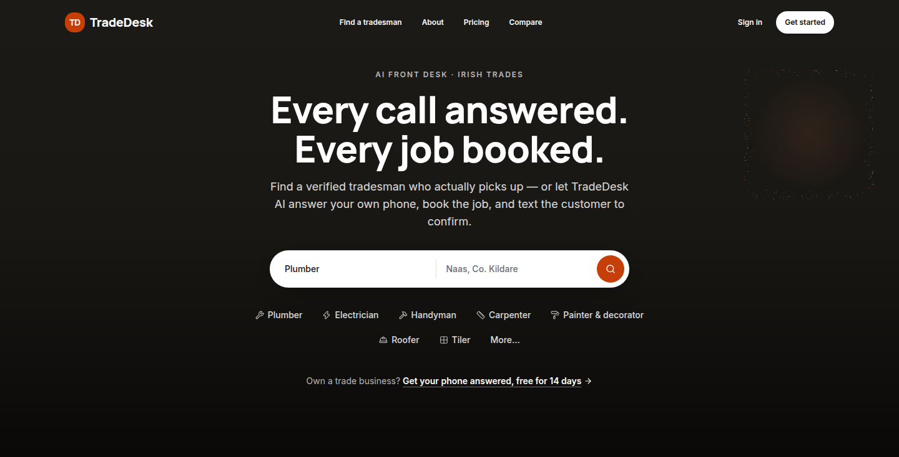

# TradeDesk AI — frontend

The marketing site, the tradesman dashboard and the homeowner marketplace for TradeDesk AI: an AI front desk that answers a trade's phone, books the job into their calendar and confirms it on WhatsApp or SMS.



📸 **[See every screen, next to the file that renders it →](docs/VISUAL_TOUR.md)**

**This repository folder is the frontend only.** Supabase schema and RLS, the AI voice tool contract, Twilio, and the booking rules are owned by the backend team. Everything the UI needs from them is defined as a typed function in [`lib/api/`](lib/api) and documented in [`docs/api-contract.md`](docs/api-contract.md); every screen runs today on mock fixtures with no backend running.

## Running it

```bash
npm install
npm run dev      # http://localhost:3000
```

No environment variables are needed. Sign-up and sign-in work out of the box against browser-local demo accounts (see **Auth** below).

```bash
npm run build    # production build + typecheck
npm run lint
```

## Auth

Without a Supabase project the app runs on **demo auth**: accounts are created and checked in your browser's `localStorage`, so you can sign up, sign in, stay signed in across reloads, and sign out. The dashboard is gated on it — visiting `/dashboard` signed out sends you to `/login`.

There's a ready-made account on the sign-in screen (the **Use the demo account** button):

```
dermot@kellyplumbing.ie / tradedesk
```

Sign up with your own name, business name and trade instead and the dashboard uses them — it's the same mock leads and calls underneath.

This is a stand-in, not a security boundary: the accounts live in one browser, and clearing site data removes them.

**Switching to real Supabase auth** is two environment variables, no code change. Copy `.env.example` to `.env.local`, fill in the project URL and anon key, restart `npm run dev`, and the same screens render Supabase Auth UI instead. `lib/api/auth.ts` documents which Supabase call each function becomes.

## What's here

Every row links to its screenshot(s) and source file in the [visual tour](docs/VISUAL_TOUR.md).

| Route                                                                     | What it is                                                                                                                                                            |
| ------------------------------------------------------------------------- | --------------------------------------------------------------------------------------------------------------------------------------------------------------------- |
| [`/`](docs/VISUAL_TOUR.md#marketing-site)                                 | Marketing homepage: dual "I need a tradesman" / "I am a tradesman" split, real reviews, a homeowner "how it works", FAQ                                               |
| [`/about`](docs/VISUAL_TOUR.md#about-page)                                | Company mission, stats, story and team                                                                                                                                |
| [`/login`, `/signup`](docs/VISUAL_TOUR.md#sign-in--sign-up)               | Sign-in and sign-up — demo auth today, Supabase Auth UI once the project exists                                                                                       |
| [`/dashboard`](docs/VISUAL_TOUR.md#overview)                              | Overview: week counters and the "needs you" queue (failed calls, unsent confirmations, untouched leads)                                                               |
| [`/dashboard/requests`](docs/VISUAL_TOUR.md#requests)                     | Requests inbox: homeowners who confirmed this business from the "find a tradesman" chat, awaiting accept/decline                                                      |
| [`/dashboard/leads`](docs/VISUAL_TOUR.md#leads)                           | Leads from the phone, the marketplace and by hand, filterable, with status changes                                                                                    |
| [`/dashboard/calendar`](docs/VISUAL_TOUR.md#calendar)                     | Week view of booked jobs against the business's working hours                                                                                                         |
| [`/dashboard/calls`](docs/VISUAL_TOUR.md#call-log)                        | Call log with the AI's outcome, its summary, and a one-click correction                                                                                               |
| [`/dashboard/messages`](docs/VISUAL_TOUR.md#confirmations)                | Booking confirmations, including failures and a re-send on the other channel                                                                                          |
| [`/dashboard/availability`](docs/VISUAL_TOUR.md#working-hours)            | Weekly working-hours editor, split days supported                                                                                                                     |
| [`/dashboard/settings`](docs/VISUAL_TOUR.md#business-profile)             | Business profile and confirmation-channel preferences                                                                                                                 |
| [`/find`, `/find/[category]/[location]`](docs/VISUAL_TOUR.md#marketplace) | Marketplace browse and search, plus a guided "find a tradesman" chat that recommends the best 5 matches                                                               |
| [`/pro/[slug]`](docs/VISUAL_TOUR.md#public-tradesman-profile)             | Public tradesman profile with services, prices and reviews — arriving from the chat swaps the contact form for a "confirm this tradesman" send-to-Requests-inbox form |

## How the data layer works

```
components  →  lib/api/*  →  lib/api/mock/*      (today)
                         →  /api/... routes      (once the backend lands)
```

1. Shapes live in [`lib/api/types.ts`](lib/api/types.ts) and mirror the Supabase columns exactly.
2. Mock fixtures live in `lib/api/mock/` and are never imported by a component.
3. Every screen calls a wrapper (`getLeads()`, `saveAvailability()`, `createMarketplaceLead()`, …). Swapping one to a real route is a one-line change inside that function.
4. Anything the backend still owes us is marked in code:

```bash
grep -rn "TODO(backend)" lib app components
```

## Stack

Next.js (App Router) · TypeScript · Tailwind CSS v4 · shadcn/ui components (vendored in `components/ui`) · lucide-react · Supabase Auth UI · deployed on Vercel.

## Conventions

- One theme, defined as tokens in `app/globals.css`: white/near-white surfaces, charcoal ink, and a single burnt-orange accent pulled from the workwear a trade actually uses on site (not an arbitrary brand colour). Don't hardcode colours in components.
- `.band-dark` gives a section a dark charcoal background with light text, for rhythm between long light stretches (the cost-comparison table, the footer, CTA bands). It's a light reskin of the same token names, so a Card or Badge dropped inside re-colours itself.
- Headlines use the `.display` class (Manrope, bold, sentence case); small letterspaced eyebrows use `.kicker`. Body copy is Inter throughout — two font families, no more.
- The homepage hero is a full-bleed photo (Booksy-style: dark scrim, white centred headline, a single search pill, a row of trade chips) — see `public/images/README.md` for the exact file it's waiting on.
- Money is integer euro cents everywhere; format with `formatEuro()` in `lib/format.ts`.
- Copy is written for a tradesman, in plain language: "missed call", "booked job", "burst pipe" — never "leverage your workflow".
