# Visual tour

Every screen in the app, screenshotted, next to the file that renders it. Start here if you want to change something and don't yet know where it lives.

Screenshots are taken against mock data at 1440×900 — see the main [README](../README.md) for how to run the app yourself. The hero photo below renders as a plain dark fallback colour in these shots because the real photo (`public/images/hero-tradesman.jpg`) is a local-only file, not committed to the repo — see [`public/images/README.md`](../public/images/README.md).

## Table of contents

- [Marketing site](#marketing-site)
- [About page](#about-page)
- [Sign in / sign up](#sign-in--sign-up)
- [Marketplace](#marketplace)
- [Tradesman dashboard](#tradesman-dashboard)

---

## Marketing site

Composed in [`app/page.tsx`](../app/page.tsx), section by section:

### Hero

**File:** [`components/marketing/hero.tsx`](../components/marketing/hero.tsx)

Full-bleed photo hero (Booksy-style): a transparent header over a darkened photo, a centred headline, one search pill, and a row of trade chips. The animated tool-assembly badge top-right is [`components/marketing/tool-badge.tsx`](../components/marketing/tool-badge.tsx) — a Canvas 2D particle animation that assembles into a spanner/screwdriver emblem, then holds with a soft glow (static on `prefers-reduced-motion`). The search pill itself is [`components/marketing/hero-search.tsx`](../components/marketing/hero-search.tsx); the transparent nav bar is [`components/site/site-header.tsx`](../components/site/site-header.tsx) (`overlay` prop).

### Audience split

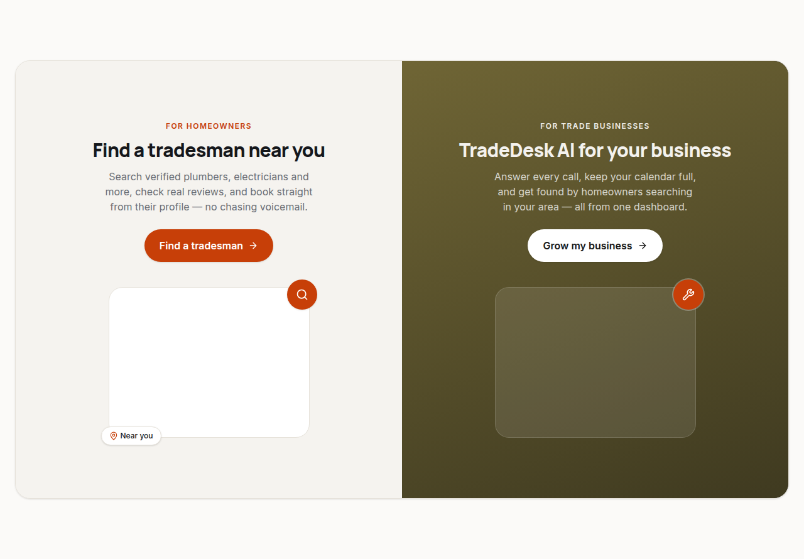

**File:** [`components/marketing/audience-split.tsx`](../components/marketing/audience-split.tsx)

The two-audience pitch, right under the hero: a homeowner panel (find a tradesman) and a business panel (TradeDesk AI for your business), so a visitor sorts themselves in one glance. Contained in one big rounded card (Booksy-style) rather than full-bleed, sitting within the page's normal max-width like every other section. Each panel's photo is a local-only file — see [`public/images/README.md`](../public/images/README.md) (`audience-homeowner.jpg` / `audience-business.jpg`); the fallback tile on the business side is a translucent `bg-white/10` rather than the default `bg-card`, so it harmonises with whatever colour sits behind it.

The business panel's background is an olive/khaki gradient (`linear-gradient(160deg, #6f6535, #3f3a20)`) rather than `.band-dark`'s default near-black, set via inline style so it doesn't depend on Tailwind's utility-vs-component cascade order. Because that gradient is much lighter than the near-black `.band-dark` is tuned for, the panel overrides its eyebrow and body text colours directly (`text-white/90` / `text-white/75`) instead of using `.kicker`'s brand-orange or the token-driven `text-muted-foreground` — both would fail contrast against this specific background.

### Trust strip

**File:** [`components/marketing/trust-strip.tsx`](../components/marketing/trust-strip.tsx)

A row of small credibility markers, now sitting under the audience split rather than directly under the hero.

### Reviews

**File:** [`components/marketing/reviews.tsx`](../components/marketing/reviews.tsx)

Real, attributed reviews pulled via [`getFeaturedReviews()`](../lib/api/marketplace.ts); star rendering is [`components/rating-stars.tsx`](../components/rating-stars.tsx).

### How it works

**File:** [`components/marketing/how-it-works.tsx`](../components/marketing/how-it-works.tsx)

### Cost comparison

**File:** [`components/marketing/cost-comparison.tsx`](../components/marketing/cost-comparison.tsx)

A dark `.band-dark` section (defined in [`app/globals.css`](../app/globals.css)) showing the cost of a missed call against TradeDesk AI.

### Pricing

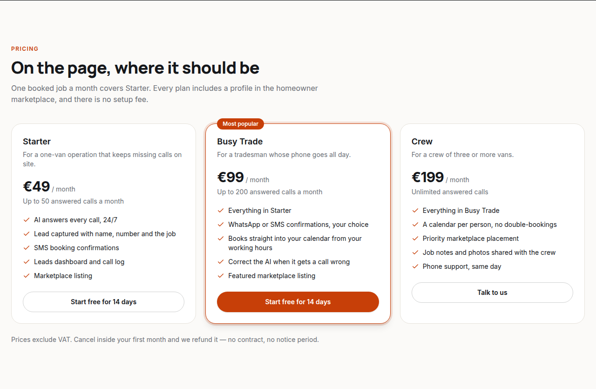

**File:** [`components/marketing/pricing.tsx`](../components/marketing/pricing.tsx)

### FAQ

**File:** [`components/marketing/faq.tsx`](../components/marketing/faq.tsx)

Built on the [`components/ui/accordion.tsx`](../components/ui/accordion.tsx) primitive.

### CTA band + footer

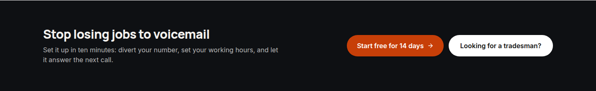

**Files:** [`components/marketing/cta-band.tsx`](../components/marketing/cta-band.tsx) · [`components/site/site-footer.tsx`](../components/site/site-footer.tsx)

---

## About page

**Route:** [`app/about/page.tsx`](../app/about/page.tsx) · content in [`lib/marketing.ts`](../lib/marketing.ts) (`aboutStats`, `aboutStoryBlocks`, `companyValues`, `teamMembers`)

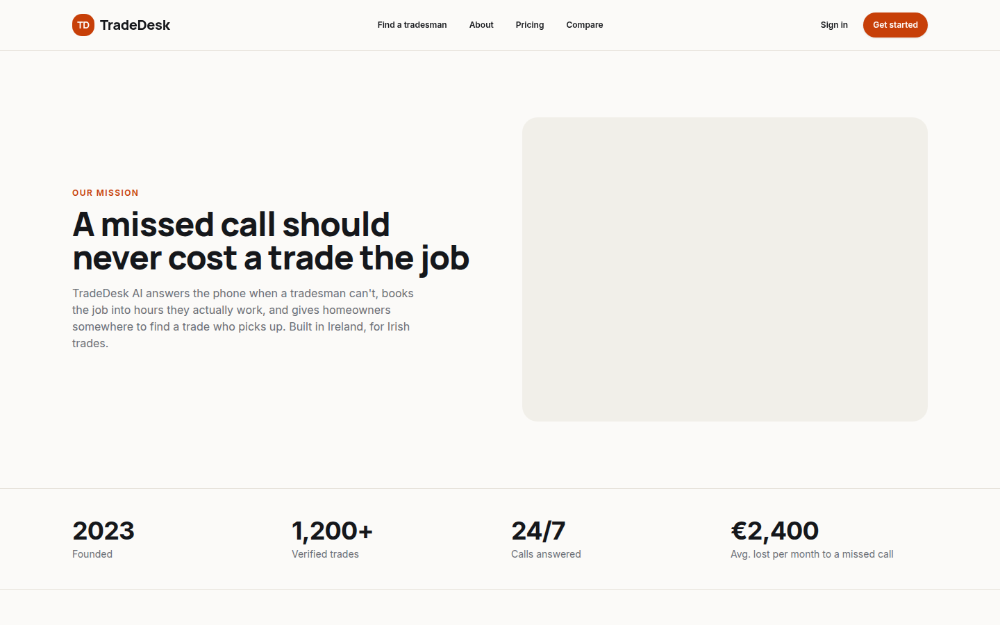

Mission statement and headline stats. The grey box is `PhotoBlock`'s fallback — same pattern as the hero, waiting on `public/images/about-team.jpg` / `about-office.jpg`.

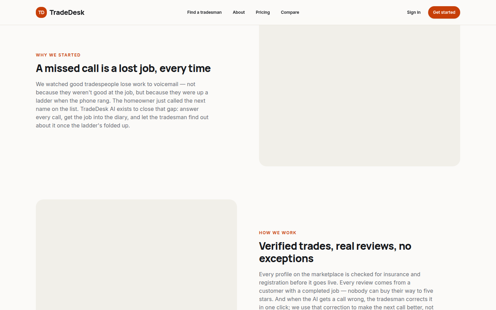

Alternating story blocks (`aboutStoryBlocks`) and, further down the page, the values checklist and team grid (`TeamAvatar` initials tiles) — not pictured above the fold here, but defined in the same file.

---

## Sign in / sign up

**Files:** [`app/login/page.tsx`](../app/login/page.tsx), [`app/signup/page.tsx`](../app/signup/page.tsx), both built from [`components/auth/auth-layout.tsx`](../components/auth/auth-layout.tsx) (the split panel) and [`components/auth/auth-panel.tsx`](../components/auth/auth-panel.tsx) (the form itself, backed by [`components/auth/demo-auth-form.tsx`](../components/auth/demo-auth-form.tsx)).

Auth is demo-only today: accounts live in browser `localStorage` via [`lib/api/mock/auth-store.ts`](../lib/api/mock/auth-store.ts). Set the two Supabase env vars and the same screens switch to real Supabase Auth UI with no component change — see `isDemoAuth` in [`lib/api/auth.ts`](../lib/api/auth.ts).

---

## Marketplace

### Browse index

**File:** [`app/find/page.tsx`](../app/find/page.tsx)

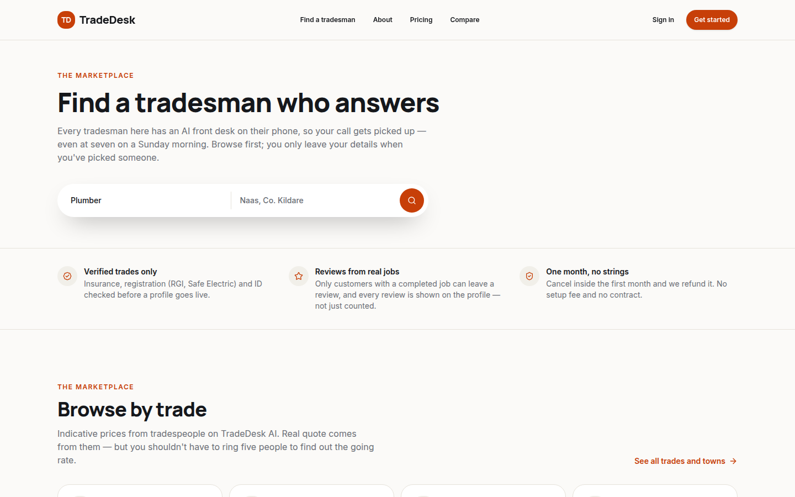

Reuses [`components/marketing/category-grid.tsx`](../components/marketing/category-grid.tsx) (browsable trade categories with indicative prices, sourced from [`getCategories()`](../lib/api/marketplace.ts)), `HeroSearch` and `TrustStrip` — `CategoryGrid` no longer appears on the homepage itself, only here.

### Search results

**File:** [`app/find/[category]/[location]/page.tsx`](../app/find/[category]/[location]/page.tsx)

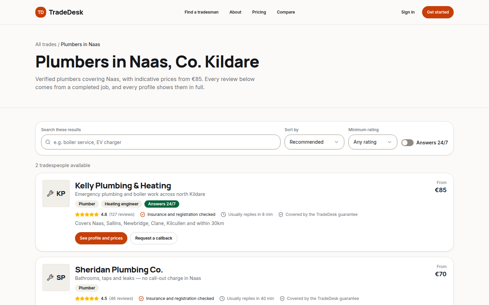

Filter bar plus the results list, rendered by [`components/marketplace/search-results.tsx`](../components/marketplace/search-results.tsx) and [`components/marketplace/listing-card.tsx`](../components/marketplace/listing-card.tsx) per profile.

### Find-a-tradesman chat

**Files:** [`components/marketplace/find-and-browse.tsx`](../components/marketplace/find-and-browse.tsx) (holds whether the chat has results yet), [`components/marketplace/find-tradesman-chat.tsx`](../components/marketplace/find-tradesman-chat.tsx) (the conversation itself), [`hooks/use-speech-to-text.ts`](../hooks/use-speech-to-text.ts) (voice input)

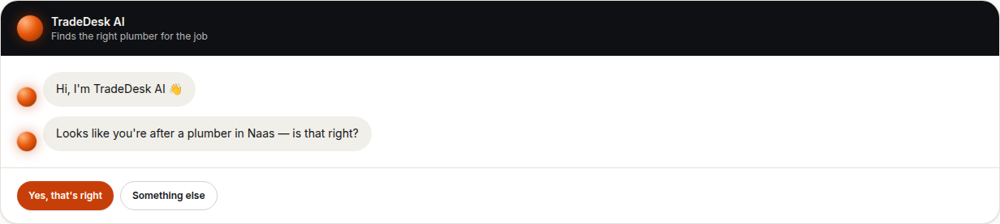

Sits above the filter bar on the same search-results page — a guided, scripted conversation (not a live model call; there's no backend/AI service wired up yet). It greets, confirms the trade this page is already scoped to ("Looks like you're after a plumber — is that right?"), then asks one question at a time: what's wrong, the Eircode, then a preferred date. Every bot message carries its own avatar — a glossy gradient sphere in the brand orange (a `radial-gradient` plus a small off-centre highlight, not a photo), which also pulses while the AI is "matching" between turns.

The issue and Eircode steps also take voice input — a mic button (hidden when the browser doesn't support the Web Speech API, e.g. Firefox) transcribes speech to text client-side and feeds it into the same typed flow; there's no server-side speech or language understanding involved. Both input steps sit inside one rounded, bordered container with the mic/send buttons docked inside it rather than beside a separately-bordered field — a single-line pill for the Eircode step, a softer large-radius rectangle for the multi-line issue step.

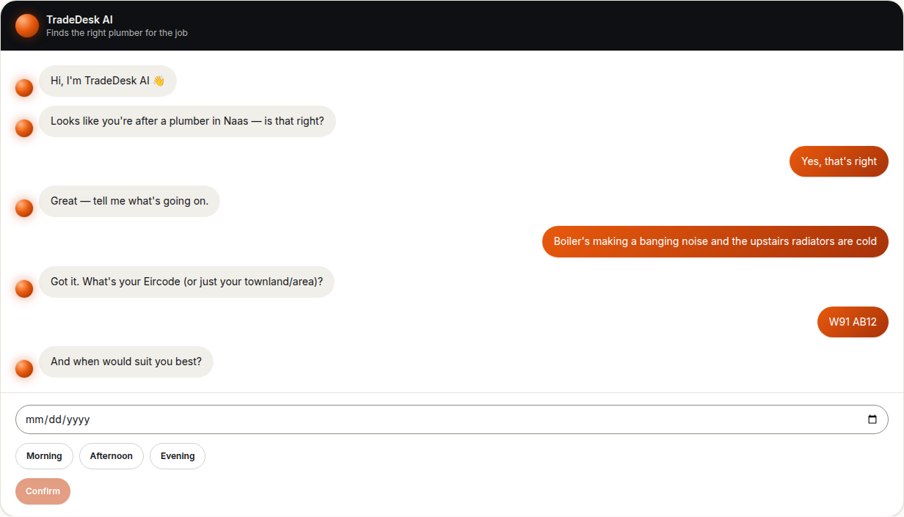

Each answer appears as its own fully-rounded bubble: the homeowner's in a diagonal orange gradient, right-aligned; the AI's in the card's neutral secondary tone, left-aligned next to its avatar. The date step is a native `<input type="date">` plus a Morning/Afternoon/Evening choice, not a hand-built calendar widget — deliberately, after an earlier hand-coded illustration on this site (see the audience-split section above) came out looking broken; native form controls avoid that risk entirely. Every quick-reply button in the chat (trade confirm, time slots) is already fully pill-shaped — that's the site's default `Button` shape, not a one-off for this component.

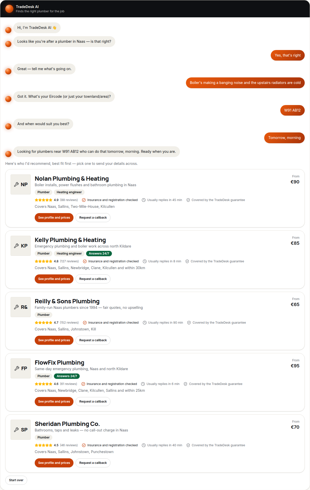

On "Find my plumbers", [`recommendTradespeople()`](../lib/api/marketplace.ts) scores every listing in this category/location — keyword overlap between the typed issue and each listing's services, plus rating, verification, review volume, and an urgency bonus for 24/7 or fast-response businesses when "Today"/"Tomorrow" was picked — and returns the top 5, reusing the same `ListingCard` the plain filtered list uses. Once the chat has an answer, `FindAndBrowse` stops rendering the plain `SearchResults` list entirely — the two are mutually exclusive, not stacked — until "Start over" resets the chat. It's a heuristic over mock data, explicitly not real language understanding; see the `recommendTradespeople` section of [`docs/api-contract.md`](api-contract.md) for how it's meant to be replaced by a real matching/AI service later without any component changing.

### Public tradesman profile

**File:** [`app/pro/[slug]/page.tsx`](../app/pro/[slug]/page.tsx)

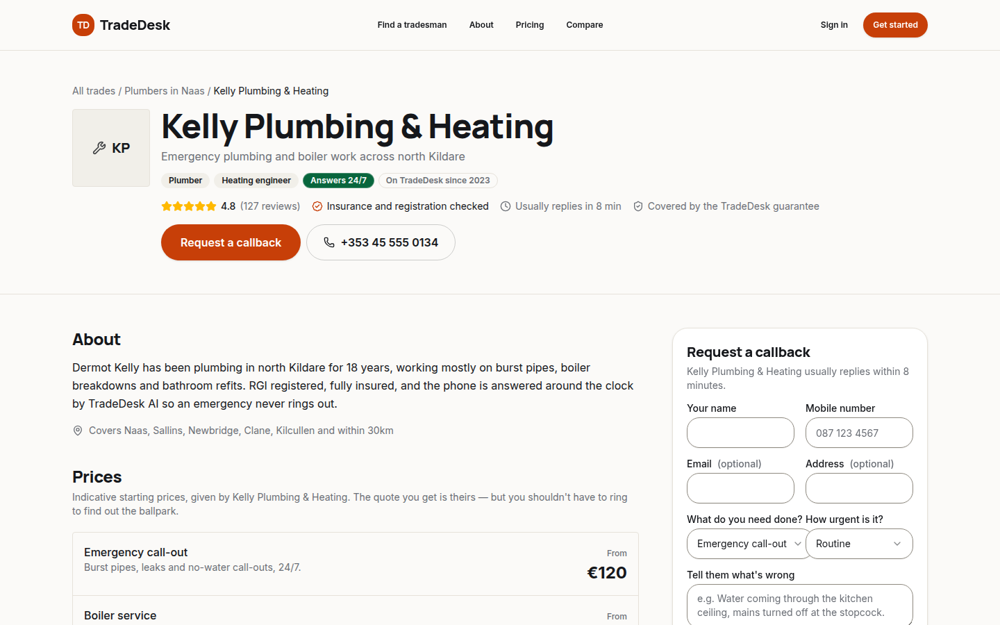

Services, prices and reviews for one tradesman ([`getMarketplaceProfile()`](../lib/api/marketplace.ts)), the trust badges via [`components/marketplace/trust-block.tsx`](../components/marketplace/trust-block.tsx), and the callback form via [`components/marketplace/contact-form.tsx`](../components/marketplace/contact-form.tsx).

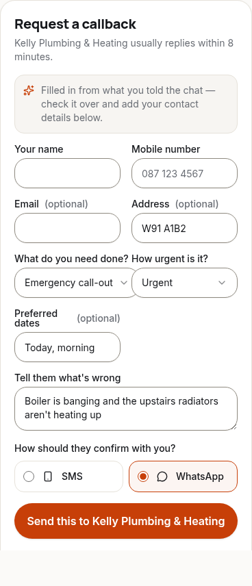

An organic visit (not from the chat) keeps this plain callback form — arriving with `?issue=&eircode=&dates=` in the URL still pre-fills the description, address and a "Preferred dates" field (`useSearchParams`, wrapped in `<Suspense>` in the page since it's a client hook), with a small banner explaining why — so nobody repeats themselves.

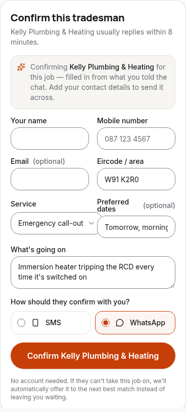

Arriving from a chat recommendation instead swaps this panel entirely for [`components/marketplace/confirm-tradesman-form.tsx`](../components/marketplace/confirm-tradesman-form.tsx) — a "Confirm this tradesman" flow, not a callback. The page (a Server Component) reads `searchParams` itself and passes plain props down, so this component never needs its own `useSearchParams()`/`<Suspense>` pair. Submitting posts a [`MatchRequest`](../lib/api/match-requests.ts) that lands in that business's **Requests** inbox for an explicit accept/decline, rather than a general lead — see below and the `Match requests` section of [`docs/api-contract.md`](api-contract.md). The URL also carries the chat's other recommendations as `?fallback=slug,slug,…`, in order — if this tradesman declines, the request automatically moves to the next one.

---

## Tradesman dashboard

Every dashboard route is gated on demo (or Supabase) auth and shares [`components/dashboard/dashboard-shell.tsx`](../components/dashboard/dashboard-shell.tsx) (the sidebar nav, defined in [`components/dashboard/dashboard-nav.ts`](../components/dashboard/dashboard-nav.ts)) and [`components/dashboard/page-header.tsx`](../components/dashboard/page-header.tsx) for the page title row.

### Overview

**File:** [`app/dashboard/page.tsx`](../app/dashboard/page.tsx)

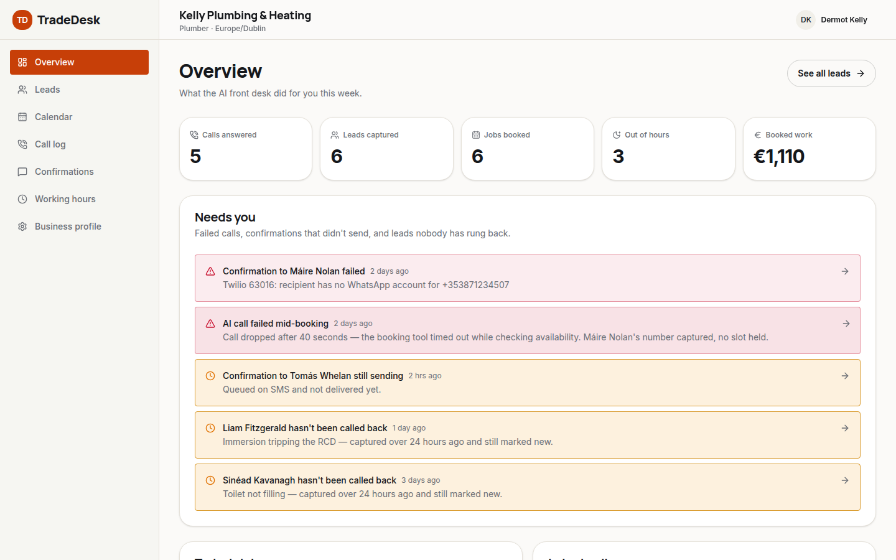

Week counters plus the "Needs you" queue — [`components/dashboard/attention-list.tsx`](../components/dashboard/attention-list.tsx) — surfacing failed calls, stuck confirmations and untouched leads. The amber warning cards use the `--warn-*` tokens from `app/globals.css`, not a hardcoded colour.

### Requests

**File:** [`app/dashboard/requests/page.tsx`](../app/dashboard/requests/page.tsx)

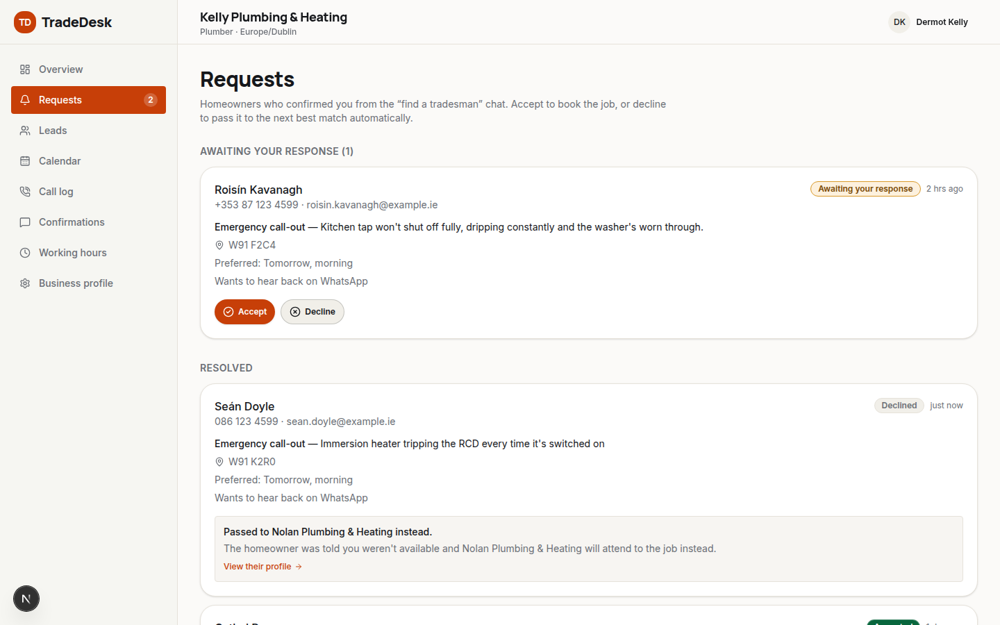

A dedicated inbox for [`MatchRequest`](../lib/api/match-requests.ts)s — homeowners who confirmed this business from the "find a tradesman" chat's "Confirm this tradesman" flow, kept separate from the general "Needs you" list on Overview. The sidebar nav ([`components/dashboard/dashboard-nav.ts`](../components/dashboard/dashboard-nav.ts)) shows a pending-count badge next to "Requests", loaded in [`components/dashboard/dashboard-shell.tsx`](../components/dashboard/dashboard-shell.tsx) so it's visible before the owner ever opens the page.

Each pending request has **Accept** and **Decline** buttons:

- **Accept** books the job — a real `leads` row (shows up on [Leads](#leads)) and a real outbound confirmation `messages` row (shows up on [Confirmations](#confirmations)), with a link straight to each. This simulates the "your request has been accepted" WhatsApp/SMS text a homeowner would get.
- **Decline** pops the next business off the chat's fallback list and resolves the request to them immediately, rendering a "Passed to X instead" preview with a real link to their profile — Seán Doyle's card above shows this. In a real system this cascade would be async (the fallback business gets its own pending request and might decline too); it resolves instantly here because this demo only ever has one signed-in business to actually respond as.

Neither branch sends a real WhatsApp/SMS message — there's no Twilio/WhatsApp Business API wired into this frontend-only project. See the `Match requests` section of [`docs/api-contract.md`](api-contract.md) for exactly what's simulated and what a backend integration would need to change.

### Leads

**File:** [`app/dashboard/leads/page.tsx`](../app/dashboard/leads/page.tsx)

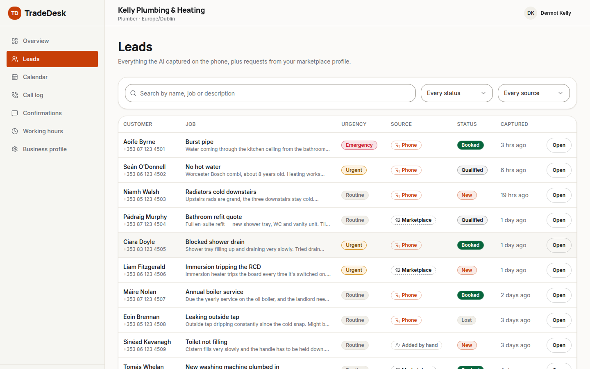

Filterable lead list; row detail opens [`components/dashboard/lead-detail-dialog.tsx`](../components/dashboard/lead-detail-dialog.tsx). Status pills are [`components/status-badge.tsx`](../components/status-badge.tsx).

### Calendar

**File:** [`app/dashboard/calendar/page.tsx`](../app/dashboard/calendar/page.tsx)

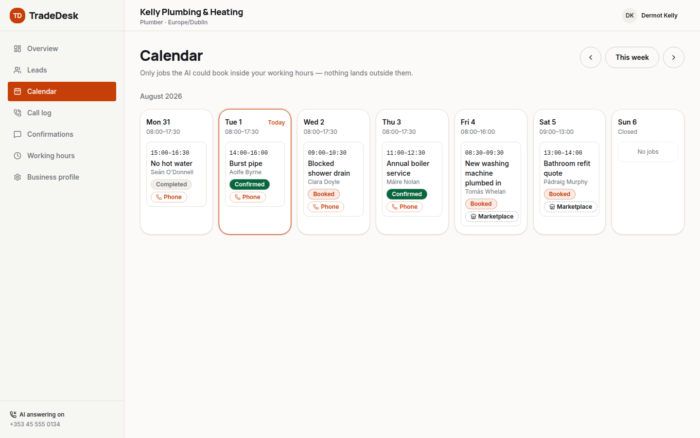

Week view of booked jobs against working hours; job detail opens [`components/dashboard/job-detail-dialog.tsx`](../components/dashboard/job-detail-dialog.tsx).

### Call log

**File:** [`app/dashboard/calls/page.tsx`](../app/dashboard/calls/page.tsx)

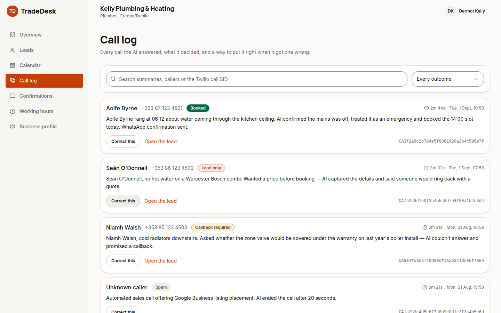

The AI's call outcomes and summaries, with a one-click correction via [`components/dashboard/reclassify-call-dialog.tsx`](../components/dashboard/reclassify-call-dialog.tsx).

### Confirmations

**File:** [`app/dashboard/messages/page.tsx`](../app/dashboard/messages/page.tsx)

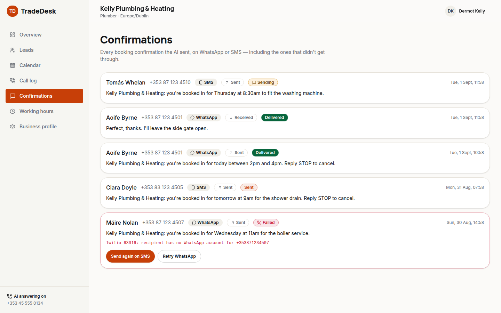

Booking confirmations sent by SMS/WhatsApp, including failures with a re-send-on-the-other-channel action.

### Working hours

**File:** [`app/dashboard/availability/page.tsx`](../app/dashboard/availability/page.tsx)

Weekly hours editor with split-day support.

### Business profile

**File:** [`app/dashboard/settings/page.tsx`](../app/dashboard/settings/page.tsx)

Business profile fields and confirmation-channel preference.

---

## Shared building blocks

Everything above is built from the same small set of primitives — worth knowing before adding a new screen:

| Piece                                                               | File                                                                |
| ------------------------------------------------------------------- | ------------------------------------------------------------------- |
| Design tokens (colour, radius, `.band-dark`, `.display`, `.kicker`) | [`app/globals.css`](../app/globals.css)                             |
| Button, Card, Badge, Input, Select, Dialog, Sheet, Alert, …         | [`components/ui/`](../components/ui)                                |
| Typed API surface (what every component is allowed to call)         | [`lib/api/types.ts`](../lib/api/types.ts), [`lib/api/`](../lib/api) |
| Mock fixtures behind that API                                       | [`lib/api/mock/`](../lib/api/mock)                                  |
| Money/date/phone formatting                                         | [`lib/format.ts`](../lib/format.ts)                                 |
